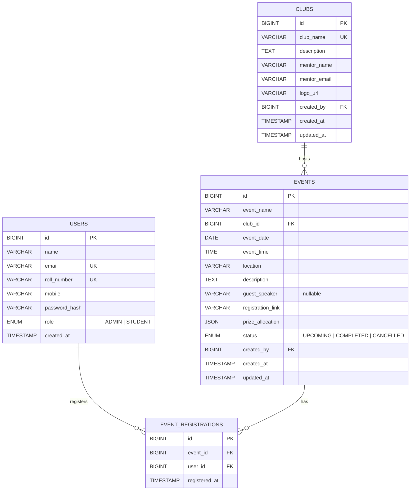

# Event Management System — Spoorthy Engineering College

A full-stack Event Management System where students can explore college clubs & events, register for events, and admins can manage all content. **Zero hardcoding** — every piece of data is fetched from MySQL via REST APIs.

---

## Project Folder Structure

```
e:\RahulEMSProject\EMS\
├── frontend/                    # HTML, CSS, JS (served statically)
│   ├── index.html               # Login page (entry point)
│   ├── register.html            # Sign-up / registration page
│   ├── home.html                # Main dashboard after login
│   ├── club-detail.html         # Individual club detail page
│   ├── event-detail.html        # Individual event detail page
│   ├── all-events.html          # "View All" events with tabs/filters
│   ├── add-club.html            # Admin — add/edit club form
│   ├── add-event.html           # Admin — add/edit event form
│   ├── css/
│   │   ├── global.css           # Design tokens, resets, typography
│   │   ├── auth.css             # Login & register page styles
│   │   ├── home.css             # Home page styles
│   │   ├── club.css             # Club detail & card styles
│   │   ├── event.css            # Event detail & card styles
│   │   └── form.css             # Admin forms (add club/event)
│   ├── js/
│   │   ├── api.js               # Centralized API helper (fetch wrapper)
│   │   ├── auth.js              # Login, register, session management
│   │   ├── home.js              # Home page logic (load clubs, events)
│   │   ├── club-detail.js       # Club detail page logic
│   │   ├── event-detail.js      # Event detail page logic
│   │   ├── all-events.js        # View-all events with tab filtering
│   │   ├── add-club.js          # Admin add/edit club form logic
│   │   └── add-event.js         # Admin add/edit event form logic
│   └── assets/
│       └── images/              # Static assets (fallback icons, etc.)
│
├── backend/                     # Java Spring Boot project
│   ├── pom.xml                  # Maven dependencies
│   ├── src/main/java/com/spoorthy/ems/
│   │   ├── EmsApplication.java           # Main entry point
│   │   ├── config/
│   │   │   ├── CorsConfig.java           # CORS settings for frontend
│   │   │   └── WebConfig.java            # Static resource config
│   │   ├── controller/
│   │   │   ├── AuthController.java       # /api/auth/* endpoints
│   │   │   ├── ClubController.java       # /api/clubs/* endpoints
│   │   │   ├── EventController.java      # /api/events/* endpoints
│   │   │   └── RegistrationController.java # /api/registrations/*
│   │   ├── service/
│   │   │   ├── AuthService.java
│   │   │   ├── ClubService.java
│   │   │   ├── EventService.java
│   │   │   ├── RegistrationService.java
│   │   │   └── EmailService.java         # Sends registration confirmation
│   │   ├── repository/
│   │   │   ├── UserRepository.java
│   │   │   ├── ClubRepository.java
│   │   │   ├── EventRepository.java
│   │   │   └── EventRegistrationRepository.java
│   │   ├── entity/
│   │   │   ├── User.java
│   │   │   ├── Club.java
│   │   │   ├── Event.java
│   │   │   └── EventRegistration.java
│   │   ├── dto/
│   │   │   ├── LoginRequest.java
│   │   │   ├── RegisterRequest.java
│   │   │   ├── ClubDTO.java
│   │   │   ├── EventDTO.java
│   │   │   ├── EventRegistrationDTO.java
│   │   │   └── ApiResponse.java          # Uniform response wrapper
│   │   └── exception/
│   │       ├── GlobalExceptionHandler.java
│   │       └── ResourceNotFoundException.java
│   └── src/main/resources/
│       ├── application.properties         # DB connection, mail config
│       └── static/                        # (empty — frontend served separately)
│
└── database/
    └── schema.sql               # All CREATE TABLE + seed data SQL
```

---

## Database Design (MySQL)

### ER Diagram



> [!IMPORTANT]
> **4 tables, not 3.** We need a separate `event_registrations` table to track which students registered for which events. This is a many-to-many junction table between `users` and `events`, and is essential for showing registered student lists to admins and registration counts on event cards.

### Table Details

#### 1. `users`
| Column | Type | Constraints |
|---|---|---|
| `id` | BIGINT AUTO_INCREMENT | PRIMARY KEY |
| `name` | VARCHAR(100) | NOT NULL |
| `email` | VARCHAR(150) | NOT NULL, UNIQUE |
| `roll_number` | VARCHAR(20) | NOT NULL, UNIQUE |
| `mobile` | VARCHAR(15) | NOT NULL |
| `password_hash` | VARCHAR(255) | NOT NULL (BCrypt hashed) |
| `role` | ENUM('ADMIN','STUDENT') | NOT NULL, DEFAULT 'STUDENT' |
| `created_at` | TIMESTAMP | DEFAULT CURRENT_TIMESTAMP |

#### 2. `clubs`
| Column | Type | Constraints |
|---|---|---|
| `id` | BIGINT AUTO_INCREMENT | PRIMARY KEY |
| `club_name` | VARCHAR(100) | NOT NULL, UNIQUE |
| `description` | TEXT | NOT NULL |
| `mentor_name` | VARCHAR(100) | NOT NULL |
| `mentor_email` | VARCHAR(150) | NOT NULL |
| `logo_url` | VARCHAR(500) | Stores path to uploaded image |
| `created_by` | BIGINT | FK → users(id) |
| `created_at` | TIMESTAMP | DEFAULT CURRENT_TIMESTAMP |
| `updated_at` | TIMESTAMP | ON UPDATE CURRENT_TIMESTAMP |

#### 3. `events`
| Column | Type | Constraints |
|---|---|---|
| `id` | BIGINT AUTO_INCREMENT | PRIMARY KEY |
| `event_name` | VARCHAR(200) | NOT NULL |
| `club_id` | BIGINT | FK → clubs(id) ON DELETE CASCADE |
| `event_date` | DATE | NOT NULL |
| `event_time` | TIME | NOT NULL |
| `location` | VARCHAR(200) | NOT NULL |
| `description` | TEXT | NOT NULL |
| `guest_speaker` | VARCHAR(150) | NULLABLE |
| `registration_link` | VARCHAR(500) | NOT NULL |
| `prize_allocation` | JSON | e.g. `[{"position":"1st","award":"Trophy + ₹5000"},...]` |
| `status` | ENUM('UPCOMING','COMPLETED','CANCELLED') | DEFAULT 'UPCOMING' |
| `created_by` | BIGINT | FK → users(id) |
| `created_at` | TIMESTAMP | DEFAULT CURRENT_TIMESTAMP |
| `updated_at` | TIMESTAMP | ON UPDATE CURRENT_TIMESTAMP |

#### 4. `event_registrations`
| Column | Type | Constraints |
|---|---|---|
| `id` | BIGINT AUTO_INCREMENT | PRIMARY KEY |
| `event_id` | BIGINT | FK → events(id) ON DELETE CASCADE |
| `user_id` | BIGINT | FK → users(id) ON DELETE CASCADE |
| `registered_at` | TIMESTAMP | DEFAULT CURRENT_TIMESTAMP |
| — | — | UNIQUE(event_id, user_id) — prevent duplicates |

### Key Relationships
- **clubs ↔ events**: One club has many events (`club_id` FK in `events`)
- **events ↔ users**: Many-to-many via `event_registrations`
- **clubs → users**: `created_by` tracks which admin created the club
- **events → users**: `created_by` tracks which admin created the event

---

## Backend REST API (Spring Boot)

### Authentication Endpoints

| Method | Endpoint | Access | Description |
|---|---|---|---|
| POST | `/api/auth/register` | Public | Register new user |
| POST | `/api/auth/login` | Public | Login (returns user data + session token) |
| GET | `/api/auth/me` | Logged in | Get current logged-in user profile |
| POST | `/api/auth/logout` | Logged in | Invalidate session |

### Club Endpoints

| Method | Endpoint | Access | Description |
|---|---|---|---|
| GET | `/api/clubs` | All | List all clubs |
| GET | `/api/clubs/{id}` | All | Get club details + its events |
| POST | `/api/clubs` | Admin | Create new club (multipart — includes logo upload) |
| PUT | `/api/clubs/{id}` | Admin | Update club |
| DELETE | `/api/clubs/{id}` | Admin | Delete club (cascades to events) |

### Event Endpoints

| Method | Endpoint | Access | Description |
|---|---|---|---|
| GET | `/api/events` | All | List all events (with optional `?status=UPCOMING&clubId=X` filters) |
| GET | `/api/events/upcoming` | All | List only upcoming events |
| GET | `/api/events/{id}` | All | Get full event details + club info + registration count |
| POST | `/api/events` | Admin | Create new event |
| PUT | `/api/events/{id}` | Admin | Update event |
| DELETE | `/api/events/{id}` | Admin | Delete event |

### Registration Endpoints

| Method | Endpoint | Access | Description |
|---|---|---|---|
| POST | `/api/registrations` | Student | Register current user for an event (sends confirmation email) |
| GET | `/api/registrations/event/{eventId}` | Admin | List all registered students for an event |
| GET | `/api/registrations/user/{userId}` | Logged in | List all events a user has registered for |
| GET | `/api/registrations/check?eventId=X&userId=Y` | Logged in | Check if user already registered |

### File Upload

| Method | Endpoint | Access | Description |
|---|---|---|---|
| POST | `/api/upload` | Admin | Upload image (club logo), returns URL path |
| GET | `/api/uploads/{filename}` | All | Serve uploaded file |

---

## Frontend — Page-by-Page Breakdown

### Design System (Color Palette & Typography)

```css
:root {
  /* Primary Palette — Deep Indigo to Violet gradient feel */
  --primary:        #4f46e5;    /* Indigo 600 */
  --primary-dark:   #3730a3;    /* Indigo 800 */
  --primary-light:  #818cf8;    /* Indigo 400 */
  --accent:         #8b5cf6;    /* Violet 500 */
  --accent-light:   #c4b5fd;    /* Violet 300 */
  
  /* Neutrals */
  --bg-primary:     #f8fafc;    /* Slate 50 */
  --bg-card:        #ffffff;
  --bg-dark:        #0f172a;    /* Slate 900 — for dark sections */
  --text-heading:   #1e293b;    /* Slate 800 */
  --text-body:      #475569;    /* Slate 600 */
  --text-muted:     #94a3b8;    /* Slate 400 */
  --border:         #e2e8f0;    /* Slate 200 */
  
  /* Semantic */
  --success:        #16a34a;
  --warning:        #d97706;
  --danger:         #dc2626;
  
  /* Shadows */
  --shadow-sm:      0 1px 2px rgba(0,0,0,0.05);
  --shadow-md:      0 4px 6px rgba(0,0,0,0.07);
  --shadow-lg:      0 10px 25px rgba(0,0,0,0.1);
  
  /* Typography — Google Font: Inter */
  --font-family:    'Inter', sans-serif;
  --radius:         12px;
}
```

### Page 1: Login (`index.html`)
- **Layout**: Centered card on a subtle gradient background
- **Fields**: Email / Roll Number input, Password input
- **Buttons**: "Login" primary button
- **Links**: "Don't have an account? Sign Up" link → `register.html`
- **Validation**: Client-side + server-side error display ("Invalid credentials")
- **JS Logic**: POST `/api/auth/login`, store user session in `localStorage`, redirect to `home.html`

### Page 2: Register (`register.html`)
- **Layout**: Centered card, same aesthetic as login
- **Fields**: Full Name, Email, Mobile, Roll Number, Role dropdown (Admin/Student), Password, Confirm Password
- **Validation**: Password match, email format, roll number format, all required
- **JS Logic**: POST `/api/auth/register`, on success → redirect to `index.html` with success toast

### Page 3: Home (`home.html`)
- **Navbar**: Logo ("Spoorthy EMS"), Nav links (Home, Clubs, Events), right side: "Add Club" button (Admin only), "Add Event" button (Admin only), Profile icon with dropdown (name, role, logout)
- **Hero Section**: Welcome banner with college info, brief about the EMS, two CTA buttons:
  - "Explore Clubs →" (smooth scrolls to clubs section)
  - "Explore Events →" (smooth scrolls to events section)
- **Clubs Section** (`#clubs`):
  - Section heading: "Our Clubs"
  - 2-row × 3-column responsive grid of club cards
  - Each card: Club logo, Club name, 2-line description (truncated), Mentor name
  - Cards are clickable → navigate to `club-detail.html?id=X`
  - Data loaded from `GET /api/clubs`
- **Events Section** (`#events`):
  - Section heading: "Upcoming Events"
  - 2-column × 3-row grid (show max 6)
  - Each card: Event name, Club badge, Date, Time, Location, Registration count badge, "Register Now" button
  - "View All →" link at bottom → `all-events.html`
  - Data loaded from `GET /api/events/upcoming`
- **Footer**: College info, quick links, social links

### Page 4: Club Detail (`club-detail.html?id=X`)
- **Hero**: Club logo large, Club name, Mentor name & email
- **About**: Full description
- **Upcoming Events Tab**: Cards of upcoming events for this club (from `GET /api/events?clubId=X&status=UPCOMING`)
- **Past Events Tab**: Cards of completed events (from `GET /api/events?clubId=X&status=COMPLETED`)
- **Admin Actions**: Edit Club / Delete Club buttons (Admin only)

### Page 5: Event Detail (`event-detail.html?id=X`)
- **Header**: Event name, Club name (clickable → club detail page), Status badge
- **Info Grid**: Date, Time, Location, Guest Speaker (if any)
- **About**: Full description
- **Prize Allocation**: Styled table/list showing 1st, 2nd, 3rd prizes
- **Register Now**: Button → opens the registration link provided by admin
- **Registration Count**: "X students registered"
- **Admin Section**: "View Registered Students" button → shows modal/table with student names, emails, roll numbers from `GET /api/registrations/event/{id}`
- **Admin Actions**: Edit Event / Delete Event buttons

### Page 6: All Events (`all-events.html`)
- **Tab Bar**: "All" | "Literary & Fine Arts" | "Coders Club" | "Cultural Club" | "Sports Club" | "Eco Club" | "Creators Club"
- Tabs are dynamically built from `GET /api/clubs` (club names as tab labels)
- Clicking "All" → `GET /api/events/upcoming`
- Clicking a club tab → `GET /api/events?clubId=X&status=UPCOMING`
- **Grid**: Same event card design as home page, but shows ALL results (paginated or scrollable)

### Page 7: Add Club (`add-club.html`) — Admin Only
- **Form**: Club Name, Description (textarea), Mentor Name, Mentor Email, Logo upload (image preview)
- **Submit**: POST `/api/clubs` (multipart/form-data)
- **Edit Mode**: If `?id=X` in URL, pre-fill form from `GET /api/clubs/{id}`, submit as PUT

### Page 8: Add Event (`add-event.html`) — Admin Only
- **Form**: Event Name, Club (dropdown from `GET /api/clubs`), Date, Time, Location, Description (textarea), Guest Speaker (optional), Registration Link, Prize Allocation (dynamic — add/remove rows: position + award)
- **Submit**: POST `/api/events`
- **Edit Mode**: If `?id=X` in URL, pre-fill, submit as PUT

---

## Session & Role Management

- On login, store `{ id, name, email, role, rollNumber }` in `localStorage`
- Every page load: `api.js` reads session from `localStorage`
  - If no session → redirect to `index.html`
  - If session exists → show/hide admin-only elements based on `role`
- Admin-only UI elements are **hidden by default** in HTML, shown via JS when `role === 'ADMIN'`
- Backend also validates role on every admin endpoint (double protection)

---

## Email Notification Flow

When a student registers for an event:
1. Frontend calls `POST /api/registrations` with `{ eventId }`
2. Backend stores registration in `event_registrations` table
3. Backend's `EmailService` sends a confirmation email to the student's email with:
   - Event name, date, time, location
   - Club name
   - Guest speaker (if any)
   - A confirmation message
4. Uses Spring Boot's `JavaMailSender` (configured via `application.properties` with SMTP details)

> [!NOTE]
> For email to work, you'll need to configure SMTP credentials (Gmail App Password or college SMTP) in `application.properties`. We can set this up during implementation.

---

## Implementation Order (Phases)

### Phase 1: Database Setup
1. Create MySQL database `spoorthy_ems`
2. Run `schema.sql` — creates all 4 tables with proper constraints and relationships
3. Insert seed data (sample admin user for testing)

### Phase 2: Backend Foundation
1. Initialize Spring Boot project with Maven (`spring-boot-starter-web`, `spring-data-jpa`, `mysql-connector`, `spring-boot-starter-mail`, `spring-boot-starter-validation`, `lombok`)
2. Configure `application.properties` (DB connection, CORS, file upload path)
3. Create entity classes matching the DB schema
4. Create repositories (JPA interfaces)
5. Build service layer with business logic
6. Build controllers (REST endpoints)
7. Add CORS configuration for frontend access
8. Add global exception handling
9. Test all endpoints

### Phase 3: Frontend — Auth Pages
1. Build design system (`global.css`)
2. Build Login page (`index.html` + `auth.css` + `auth.js`)
3. Build Register page (`register.html`)
4. Build `api.js` (centralized fetch wrapper with error handling)

### Phase 4: Frontend — Home & Navigation
1. Build Home page structure and hero section
2. Build responsive navbar with role-based buttons
3. Build Clubs section (dynamic grid from API)
4. Build Events section (dynamic grid from API)
5. Implement smooth scrolling for CTA buttons

### Phase 5: Frontend — Detail Pages
1. Build Club Detail page
2. Build Event Detail page with prize allocation display
3. Build "View All Events" page with tab filtering

### Phase 6: Frontend — Admin Features
1. Build Add Club form with image upload
2. Build Add Event form with dynamic prize allocation rows
3. Wire up edit/delete functionality
4. Build registered students modal for admins

### Phase 7: Email & Polish
1. Configure and test email service
2. Add loading states, error toasts, empty states
3. Responsive testing and mobile optimization
4. Final UI polish (animations, transitions, hover effects)

---

## Verification Plan

### Automated Tests
- Test all API endpoints using Postman or curl commands
- Verify DB constraints (unique email, unique roll number, FK cascades)
- Test role-based access (student cannot hit admin endpoints)

### Manual Verification
1. **Register** a new student → verify data in `users` table
2. **Register** a new admin → verify role stored correctly
3. **Login** with valid/invalid credentials → verify success/error responses
4. **Admin: Add Club** with logo → verify club appears on home page
5. **Admin: Add Event** linked to club → verify event appears in both home events section AND club detail page
6. **Student: Register for Event** → verify registration stored, email sent, count incremented
7. **Admin: View Registered Students** → verify full student list visible
8. **Tab Filtering** on "View All Events" → verify club-specific filtering works
9. **Navigation**: Club card → Club detail → Event card → Event detail → Club name link → back to club detail (full circular navigation)
10. **Responsive**: Test on mobile viewport (375px), tablet (768px), desktop (1440px)

---

## Open Questions

> [!IMPORTANT]
> **MySQL Credentials**: What are your MySQL username, password, and preferred database name? I'll use `root` / `root` / `spoorthy_ems` as defaults — let me know if different.

> [!IMPORTANT]
> **Java Version & Build Tool**: Are you using Java 17+ and Maven? I'll set up a Spring Boot 3.x project with Maven — confirm if you prefer Gradle instead.

> [!IMPORTANT]
> **Email SMTP**: Do you have a Gmail App Password or college SMTP server ready for sending registration emails? We can skip email initially and add it later if preferred.

> [!IMPORTANT]
> **File Storage for Club Logos**: Should uploaded logos be stored on the local filesystem (simple) or do you have a cloud storage preference? I'll default to local filesystem (`/uploads/` directory).

> [!IMPORTANT]
> **Authentication Approach**: For this project, I'll use simple session-based auth with `HttpSession` (Spring's built-in session management). This avoids JWT complexity while still being secure. Let me know if you want JWT instead.
